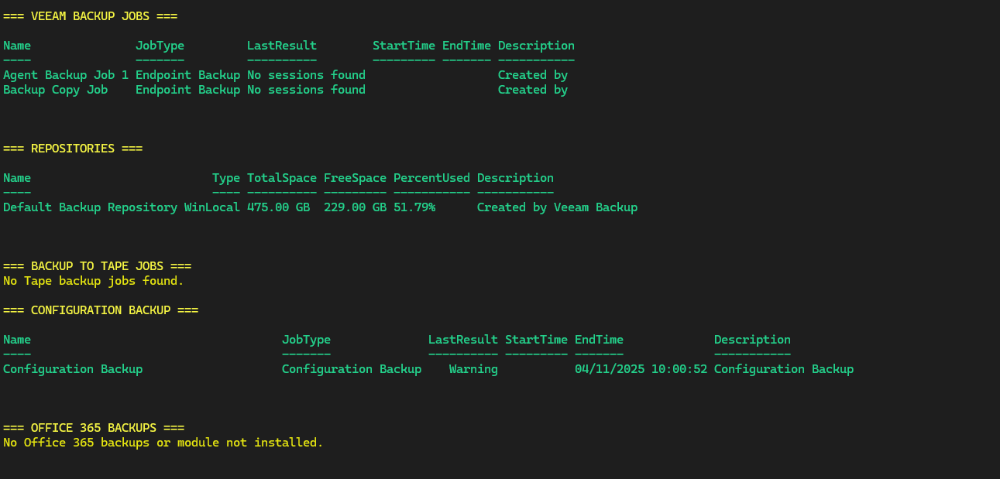

# Veeam Backup Report Script
[](https://learn.microsoft.com/powershell/)
[](https://github.com/Klmouts/powershell-veeam-backup-check/blob/main/LICENSE)
[](https://github.com/Klmouts/powershell-veeam-backup-check/blob/main/main.ps1)


## Overview

This PowerShell script is designed to generate a comprehensive report of Veeam backup jobs and repository details. It leverages Veeam Backup & Replication PowerShell modules and the Veeam Backup for Office 365 module to gather and present data about backup jobs, their statuses, and backup repositories.

## Features

-  **Backup Job Details** — Retrieves all Veeam job types (VM, endpoint, replication, policy, etc.).
-  **Configuration Backup Info** — Displays the latest configuration backup job status.
-  **Repository Statistics** — Reports total/free space and usage percentage.
-  **Tape Backup Jobs** — Includes backup-to-tape job details if present.
-  **Office 365 Integration** *(optional)* — Reports on Office 365 backup jobs if module is installed.
-  **Automatic CSV Export** — Saves a unified timestamped report under `/Reports/`.

## Requirements

| Component | Description |
|------------|-------------|
| **Veeam Backup & Replication PowerShell Modules** | Required for all backup job and repository data. |
| **Veeam Backup for Microsoft 365 Module** | Optional; only needed for Office 365 backup details. |
| **PowerShell 5.1+** | Recommended for full compatibility. |

## Usage

1. **Load the Script:**
   - Open a PowerShell terminal.
2. **Run the Script:**
   - Navigate to the directory containing the script.
   - Execute the script by running:
     ```powershell
     .\VeeamScriptReport.ps1
     ```
3. **Review the Report:**
   - The script will output a summary of backup jobs and repository details directly in the PowerShell window.

### Example Output



## Feedback
Found a bug or want a feature? Open an issue or submit a pull request.

## Author

**Name**: Klontian Moutsa

## License

[](./LICENSE)

This project is licensed under the [MIT License](./LICENSE).  
© 2024 Klontian Moutsa. All rights reserved.

## Notes

- The script was created on 29/08/2024.
- Ensure that you have the required Veeam modules installed before running the script.


